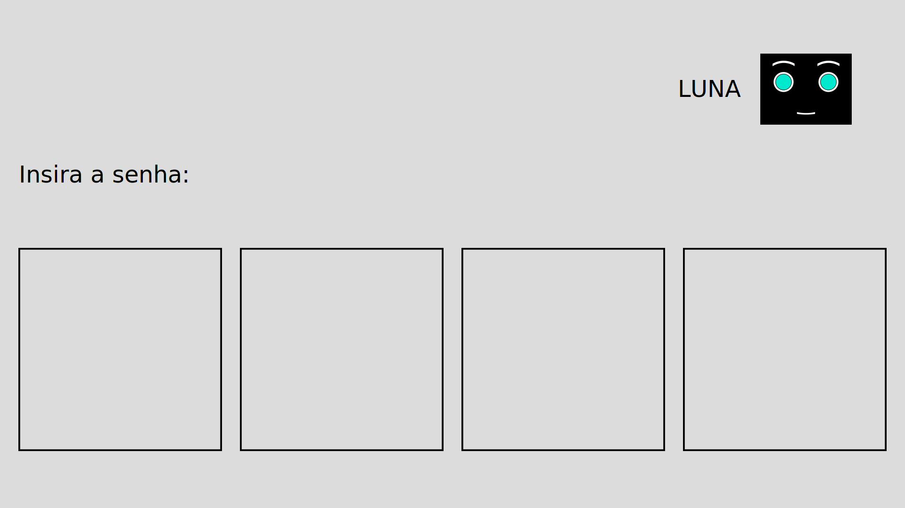

# Screen applications

## Description
This is the ROS package for screen applications used in the experiments. Each phase of the experiment has its own application. More information can be found [here](https://gitlab.com/adorno-at-macro/experimental-robotics/human-robot-communication/screen-applications/-/wikis/General-information) or in the comments of the scripts.

### Password
<p align="center"></p>

This application shows the status of the first phase of the experiment, in which a sequence of colors should be indicated as a password.

You can set some parameters in the [main script](src/main_password.py) and use it to run the application or use the launch file, as shown below:

```
roslaunch screen password.launch
```

### Counting
<p align="center"></p>

This application is used in the second phase of the experiment, in which the participant should enter some values in the appropriate text fields.

You can set some parameters in the [main script](src/main_counting.py) and use it to run the application or use the launch file, as shown below:

```
roslaunch screen counting.launch
```

## Experiments
For the experiments, the [main_experiments.py](src/main_experiments.py) script controls the applications and open them when appropriate, including some messages and blank screens.

To run, type on a terminal:
```
roslaunch screen screen.launch
```

If using the script for the experiments, you can control what will be displayed in the screen by publishing in the /screen_commands topic.
