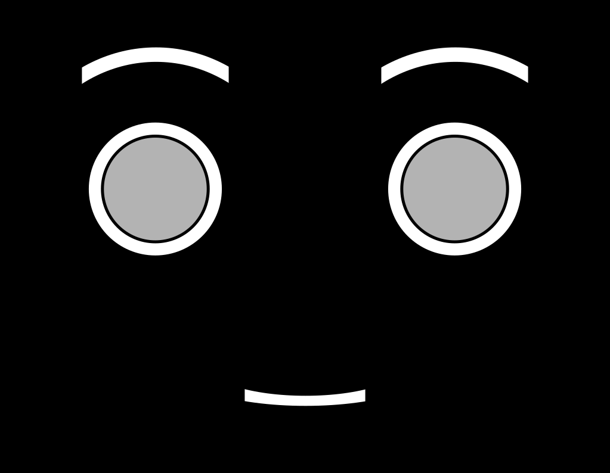

# Virtual Agent

## Description
This is the ROS package for the virtual agent. It is equipped with voice, facial expressions, and gaze simulation.

<p align="center"></p>

The application uses OpenCV to manipulate the images of the virtual agent's face and Tkinter to display it. There are several images for each virtual agent and its facial expressions, the voice is created using prerecorded audio files, and the head movement to represent the virtual agent's gaze is simulated using projective geometry. More information about the application can be found [here](https://gitlab.com/adorno-at-macro/experimental-robotics/human-robot-communication/robot-face-and-voice/-/wikis/General-information) and in the paper:

_A. C. A. Campos and B. V. Adorno, "Development of Human-Robot Communication Technologies for Future Interaction Experiments," 2020 Latin American Robotics Symposium (LARS), 2020 Brazilian Symposium on Robotics (SBR) and 2020 Workshop on Robotics in Education (WRE), Natal, Brazil, 2020, pp. 1-6, doi: 10.1109/LARS/SBR/WRE51543.2020.9306965_. ([link](https://ieeexplore.ieee.org/document/9306965))

## How to install
Some packages need to be installed in order to use the application. 

[Pillow](https://pillow.readthedocs.io/en/stable/) and [OpenCV](https://opencv.org/) are used in image manipulations. To install them, you can run on a terminal:
```
pip3 install Pillow
pip3 install opencv-python
```

For the simulation of gaze, you need to install [DQ Robotics](https://dqrobotics.github.io/). On a terminal, run:
```
python3 -m pip install --user dqrobotics
```

Finally, clone the repository in your catkin workspace:
```
cd ~/catkin_ws/src
git clone https://gitlab.com/adorno-at-macro/experimental-robotics/human-robot-communication/virtual-agent.git
```

## How to run

With the package already in your ROS catkin workspace, you can run the application using a launch file. First, you need to set the parameters in [launch_va.launch](https://gitlab.com/adorno-at-macro/experimental-robotics/human-robot-communication/robot-face-and-voice/-/blob/b2e098b066fd998a553ad53c81dc68b0754cbadd/launch/launch_va.launch) (the file contains instructions) and then, on a terminal, run:

```
roslaunch virtual-agent launch_va.launch
```

There are a specific [script](https://gitlab.com/adorno-at-macro/experimental-robotics/human-robot-communication/robot-face-and-voice/-/blob/b2e098b066fd998a553ad53c81dc68b0754cbadd/src/main_experiments.py) for the experiment and launch files associated to each one of the two virtual agent's applications ([phase 1](https://gitlab.com/adorno-at-macro/experimental-robotics/human-robot-communication/robot-face-and-voice/-/blob/b2e098b066fd998a553ad53c81dc68b0754cbadd/launch/launch_phase1.launch) and [phase 2](https://gitlab.com/adorno-at-macro/experimental-robotics/human-robot-communication/robot-face-and-voice/-/blob/b2e098b066fd998a553ad53c81dc68b0754cbadd/launch/launch_phase2.launch)). The parameters can also be set following the instructions given in the launch files. To execute it, run:

 ```
roslaunch virtual-agent launch_phase1.launch
```
or
```
roslaunch virtual-agent launch_phase2.launch
```

